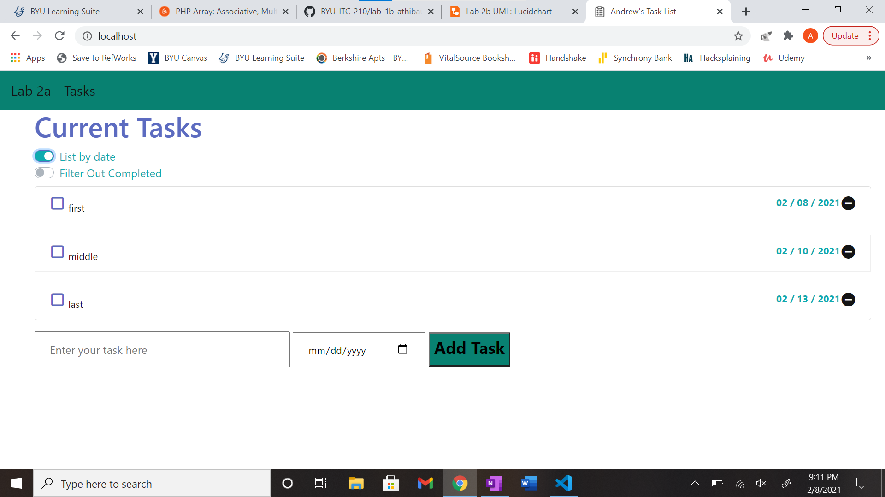
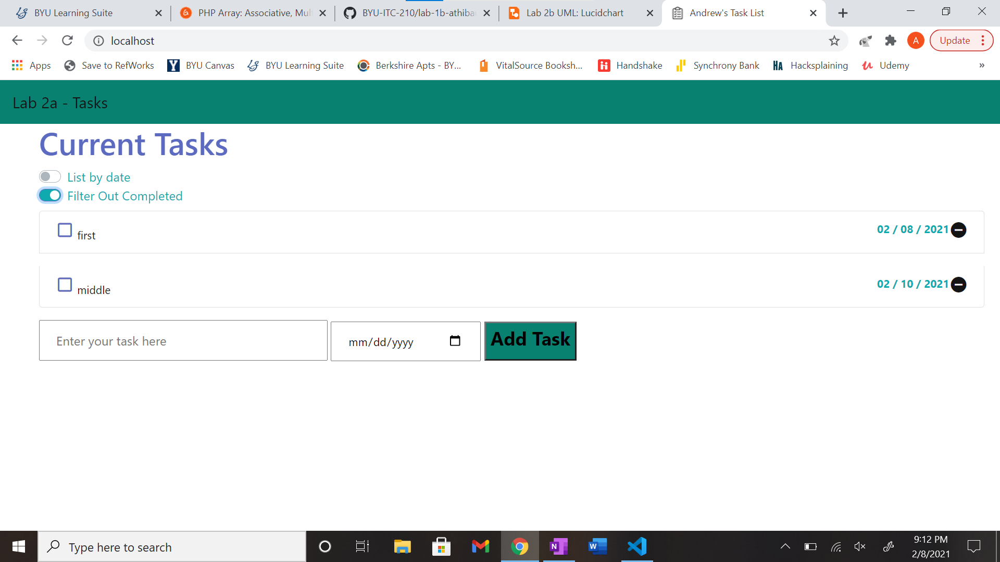
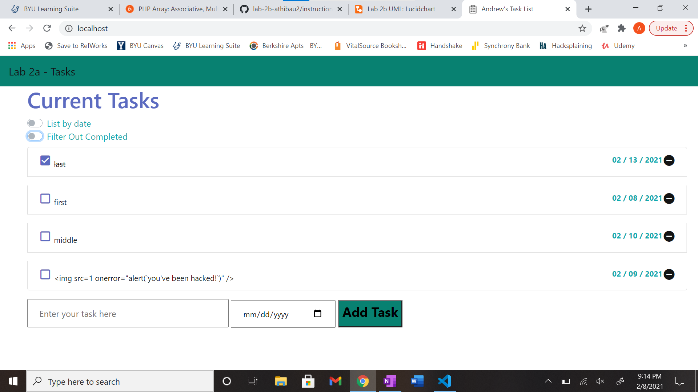

# Andrew Thibaudeau     02/08/2021      Lab 2b

## <strong>Executive Summary</strong>

&nbsp;&nbsp;&nbsp;&nbsp;&nbsp;&nbsp;In this lab, I added dynamic functionality to my webpage using JavaScript. I did this by using HTML templates and form inputs to save user input to the local storage of my web browser. I used icons and buttons to add new tasks, check off tasks, and delete tasks. Additionally, I added filtering functionality to my webpage. I used two switches, one to sort the tasks by the due date and one to filter out the completed tasks. I did this using higher order functions in JavaScript. I also prevented cross site scripting.   

## <strong>Design Overview</strong>

1. This screenshot is the UML for part 'a' of lab 2, which includes all the functionality mentioned above in the Executive Summary except for the filtering switches and cross site scripting prevention.
  

2. This screenshot is the UML for part 'b' of lab 2, which includes the filtering switches.
  

3. This screenshot shows the 'sort by date' switch properly working, displaying tasks from soonest due date to latest due date.
  

4. This screenshot shows the 'filter completed' switch properly working, no longer showing the task "last", which was checked off.
  

5. This screenshot shows the cross site scripting prevention working properly. I submitted a task with an attack, and rather than being successfully hacked, it was stored as a task.
  

### <strong>Files:</strong>
1. <em>script.js</em>
    * This contains all of my JavaScript functions, including a class and higher order functions. It allows my webpage to have dynamic user capabilities.

2. <em>style.css</em>
    * Same as in Lab 2, this CSS file is what gives my webpage aesthetic look and style.

3. <em>index.html</em>
    * Same as in Lab 2, this HTML file contains the structure of the information displayed on the webpage.

4. <em>docker-compose.yml</em>
    * This file allows my project to be contained and sent to the web server via necessary server ports.

5. <em>screenshots</em>
    * This folder contains 5 screenshots used in this lab report.

6. <em>icons</em>
    * This folder contains icons used on my webpage:
        - Outlined check box
        - Filled in check box
        - Delete circle
        - Task list for the web tab
  

## <strong>Questions</strong>
### <em>Lab 2a</em>
1. What are two differences and similarities between JavaScript and C++?
    * Differences:
        - C++ requires variables to be a declared type, and they never change type; JavaScript automatically assigns declared variables appropriate types depending on the value assigned to it, and they can be reassigned new types with new values. 
        - JavaScript is an interpreted scripting language; C++ is a compiled programming language
    * Similarities:
        - Both JavaScript and C++ are object oriented and use classes
        - They both use curly brace notation

2. What is the difference between JSON and JavaScript objects?
    * JSON objects are stored as a string; JavaScript objects are stored as a combination of values with different types.

3. If you open your web page in two different browsers, will changes on one appear on the other? Why or why not?
    * Changes do <em>not</em> appear from one browser to the next because are two different sets of local cache stored from the web page.

4. How long did you spend on this lab?
    * Approximately 6-7 hours.

### <em>Lab 2b</em>
1. How did you protect your site against Cross-Site Scripting? Which type of Cross-Site Scripting did you protect against?
    * I used a higher order escape function to identify HTML characters in the user input field, and convert those to the literal characters, thus displaying the XSS attach as a task. I protected against DOM-based attacks.

2. What is a Higher-Order Function?
    * Higher order functions are functions that call another function, take another function as a parameter, or return a function. 

3. What are the differences between the oninput, onkeyup, and onchange events? When do they trigger, when might you use one over the others?
    * <em>Oninput:</em>
        - Event occurs immediately when input changes
    * <em>Onkeyup:</em>
        - Event occurs when a user releases a key; thus, a user could hold down a key long enough to produce several characters.
    * <em>Onchange</em>
        - Event occurs when the value of an element has changed.
  

## <strong>Lessons Learned</strong>
1. <em>Duplicating an array:</em>
    * One very helpful way to manipulate arrays is to make a copy and work with that so you don't lose any original data. However, depending on how you copy it, you may still accidentally modify the original array. Doing "let copyArray = array;" will make copyArray reference the values in array, thus changing both arrays when copyArray is modified. This is called a "shallow copy". To make a "deep copy", use the .map() method, or a combination of JSON.stringify() and JSON.parse().

2. <em>Updating local storage:</em>
    * Sometimes you need to change what you are displaying on your webpage, but only temporarily. If you update the local storage with your temporary information, it can work to toggle back and forth until the page refreshes, and then your data will be permanently overwritten. Make sure you only read out copies of temporary information, and leave the local storage alone.

3. <em>Preventing XSS:</em>
    * Preventing cross site scripting requires error checking. If you aren't thorough enough you will miss something, and an attack will be successful against your webpage. A concise and useful way to prevent a hack is to use a higher order function that escapes the input text, and checks for certain characters.
  

## <strong>Conclusions</strong>
* Prevent cross site scripting DOM-based attacks.
* Use higher order functions in JavaScript.
* Toggle information to be displayed to a web page.

  

## <strong>References</strong>
* https://www.w3schools.com/js/DEFAULT.asp
* https://www.hacksplaining.com/exercises/xss-stored#/start